# Workflow Git + Vercel : Commits Automatiques

## 🔄 Processus complet

### 1. Configuration initiale

#### GitHub Repository
```bash
# Votre repo existant
https://github.com/username/photographe
```

#### Vercel Connection
- Connecter le repo GitHub à Vercel
- Auto-déploiement sur push vers `main`
- Variables d'environnement configurées

### 2. Flux de modification via backoffice

```mermaid
sequenceDiagram
    participant U as Utilisateur Admin
    participant B as Backoffice React
    participant API as Vercel Function
    participant F as Fichier albums.js
    participant G as Git/GitHub
    participant V as Vercel Deploy
    
    U->>B: Ajoute/modifie album
    B->>API: POST /api/albums/update
    API->>F: Modifie albums.js
    API->>G: git add + commit + push
    G->>V: Webhook déclenché
    V->>V: Redéploiement automatique
    V->>B: Site mis à jour
```



### 3. API de modification avec Git

```javascript
// /api/albums/update-file.js
import { execSync } from 'child_process';
import fs from 'fs';
import path from 'path';

export default async function handler(req, res) {
  if (req.method !== 'POST') {
    return res.status(405).json({ error: 'Method not allowed' });
  }

  try {
    const { albumsData } = req.body;
    
    // 1. Écrire le nouveau fichier albums.js
    const filePath = path.join(process.cwd(), 'client/src/data/albums.js');
    const fileContent = `export const albumsData = ${JSON.stringify(albumsData, null, 2)};

// Helper function to get album by ID
export const getAlbumById = (id) => {
  return albumsData.find(album => album.id === id);
};

// Helper function to get albums for gallery (without photos data)
export const getGalleryAlbums = () => {
  return albumsData
    .map(({ photos, ...album }) => album)
    .sort((a, b) => (a.sortOrder || 0) - (b.sortOrder || 0));
};

// Helper function to get all unique categories
export const getAllCategories = () => {
  const categories = [...new Set(albumsData.map(album => album.category))];
  return categories.sort();
};`;

    fs.writeFileSync(filePath, fileContent);

    // 2. Configuration Git
    execSync(`git config user.name "${process.env.GIT_USER_NAME}"`);
    execSync(`git config user.email "${process.env.GIT_USER_EMAIL}"`);
    
    // 3. Commit et push
    execSync('git add client/src/data/albums.js');
    execSync(`git commit -m "Update albums data via admin panel - ${new Date().toISOString()}"`);
    execSync('git push origin main');
    
    res.status(200).json({ 
      success: true, 
      message: 'Albums updated and deployed successfully' 
    });
    
  } catch (error) {
    console.error('Error updating albums:', error);
    res.status(500).json({ 
      error: 'Failed to update albums', 
      details: error.message 
    });
  }
}
```

### 4. Variables d'environnement Vercel

```env
# Git Configuration
GITHUB_TOKEN=ghp_xxxxxxxxxxxxxxxxxxxx
GIT_USER_NAME=Admin Bot
GIT_USER_EMAIL=admin@yoursite.com

# Cloudinary
CLOUDINARY_CLOUD_NAME=your_cloud_name
CLOUDINARY_API_KEY=your_api_key
CLOUDINARY_API_SECRET=your_api_secret

# Auth
JWT_SECRET=your_super_secret_key
ADMIN_USERNAME=admin
ADMIN_PASSWORD_HASH=$2b$10$...
```

### 5. Configuration GitHub Token

#### Créer un Personal Access Token
1. GitHub → Settings → Developer settings → Personal access tokens
2. Generate new token (classic)
3. Scopes nécessaires :
   - `repo` (Full control of private repositories)
   - `workflow` (Update GitHub Action workflows)

#### Permissions requises
```
repo:status
repo_deployment
public_repo
repo:invite
security_events
```

### 6. Sécurité et bonnes pratiques

#### Protection des commits
```javascript
// Validation avant commit
const validateAlbumsData = (data) => {
  if (!Array.isArray(data)) throw new Error('Invalid albums data');
  
  data.forEach(album => {
    if (!album.id || !album.title) {
      throw new Error('Missing required album fields');
    }
    if (album.coverImage && !isValidCloudinaryUrl(album.coverImage)) {
      throw new Error('Invalid Cloudinary URL');
    }
  });
};

const isValidCloudinaryUrl = (url) => {
  return url.includes('res.cloudinary.com') && url.includes('image/upload');
};
```

#### Gestion des erreurs Git
```javascript
const safeGitOperation = async (operation) => {
  try {
    execSync(operation, { stdio: 'pipe' });
  } catch (error) {
    // Rollback en cas d'erreur
    execSync('git reset --hard HEAD~1');
    throw new Error(`Git operation failed: ${error.message}`);
  }
};
```

### 7. Monitoring et logs

#### Logs des modifications
```javascript
// Log chaque modification
const logChange = (action, albumId, userId) => {
  console.log(`[${new Date().toISOString()}] ${action} - Album: ${albumId} - User: ${userId}`);
};
```

#### Webhook Vercel (optionnel)
```javascript
// /api/webhooks/deploy-status.js
export default function handler(req, res) {
  const { deployment } = req.body;
  
  if (deployment.state === 'READY') {
    // Notifier l'admin que le déploiement est terminé
    console.log('Deployment successful:', deployment.url);
  }
  
  res.status(200).json({ received: true });
}
```

## ⚡ Avantages de cette approche

1. **Automatisation complète** : Modification → Commit → Déploiement
2. **Historique Git** : Toutes les modifications sont trackées
3. **Rollback facile** : Possibilité de revenir en arrière
4. **Sécurisé** : Tokens et authentification
5. **Transparent** : Logs de toutes les opérations

## 🚨 Points d'attention

1. **Rate limiting GitHub** : Limiter les commits (max 1/minute)
2. **Gestion des conflits** : Éviter les modifications simultanées
3. **Backup** : Sauvegarder avant chaque modification
4. **Monitoring** : Surveiller les échecs de déploiement

Cette approche garantit que chaque modification du backoffice déclenche automatiquement un redéploiement via Git, tout en gardant un historique complet des changements.