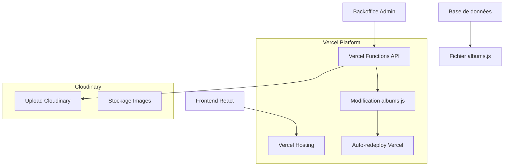

# Plan de Migration : Vercel + Cloudinary + Backoffice Dynamique

## 🎯 Objectif
Migrer le site de photographe de GitHub Pages vers Vercel avec un backoffice fonctionnel permettant la gestion dynamique des albums via modification du fichier [`albums.js`](../client/src/data/albums.js) côté serveur.

## 📊 Analyse de l'existant

### Architecture actuelle
- **Frontend** : React déployé sur GitHub Pages
- **Données** : Fichier statique [`albums.js`](../client/src/data/albums.js) avec URLs Cloudinary
- **Backoffice** : Interface React utilisant localStorage (non fonctionnel en production)
- **Images** : Stockées sur Cloudinary

### Problèmes identifiés
1. GitHub Pages ne supporte pas les fonctions serverless
2. Le backoffice utilise localStorage (données perdues)
3. Pas de persistance des modifications
4. Authentification basique côté client uniquement

## 🏗️ Nouvelle Architecture



### Composants principaux

#### 1. Frontend React (Vercel)
- **Localisation** : `/client/src/`
- **Fonctionnalités** : 
  - Affichage des galeries (inchangé)
  - Interface d'administration améliorée
  - Intégration avec les nouvelles APIs

#### 2. API Vercel Functions
- **Localisation** : `/api/`
- **Endpoints** :
  - `POST /api/auth/login` - Authentification admin
  - `GET /api/albums` - Récupération des albums
  - `POST /api/albums` - Création d'album
  - `PUT /api/albums/:id` - Modification d'album
  - `DELETE /api/albums/:id` - Suppression d'album
  - `POST /api/photos/upload` - Upload vers Cloudinary
  - `POST /api/albums/update-file` - Mise à jour du fichier albums.js

#### 3. Intégration Git + Vercel
- **Auto-déploiement** : Connexion GitHub → Vercel
- **Commit automatique** : Les APIs modifient le fichier et commitent
- **Webhook Vercel** : Redéploiement automatique après push

#### 4. Système d'authentification
- **JWT tokens** pour sécuriser les APIs
- **Variables d'environnement** pour les secrets
- **Session management** côté client

#### 4. Intégration Cloudinary
- **Upload direct** depuis le backoffice
- **Gestion des transformations** d'images
- **URLs optimisées** pour le web

## 📋 Plan de développement détaillé

### Phase 1 : Configuration de l'environnement
1. **Initialiser le projet Vercel**
   - Créer `vercel.json`
   - Configurer les variables d'environnement
   - Définir les routes API

2. **Configuration Cloudinary**
   - Récupérer les clés API
   - Configurer les presets d'upload
   - Tester l'intégration

### Phase 2 : Développement des APIs
1. **API d'authentification**
   ```javascript
   // /api/auth/login.js
   export default function handler(req, res) {
     // Vérification des credentials
     // Génération JWT token
     // Retour du token sécurisé
   }
   ```

2. **API de gestion des albums**
   ```javascript
   // /api/albums/index.js
   export default function handler(req, res) {
     switch(req.method) {
       case 'GET': return getAlbums(req, res);
       case 'POST': return createAlbum(req, res);
       // ...
     }
   }
   ```

3. **API de modification du fichier + Git**
   ```javascript
   // /api/albums/update-file.js
   import { execSync } from 'child_process';
   import fs from 'fs';
   
   export default function handler(req, res) {
     // 1. Lecture du fichier albums.js
     // 2. Modification des données
     // 3. Écriture du nouveau fichier
     // 4. Git add + commit + push automatique
     execSync('git add client/src/data/albums.js');
     execSync('git commit -m "Update albums data via admin"');
     execSync('git push origin main');
     // 5. Vercel redéploie automatiquement
   }
   ```

### Phase 3 : Modification du backoffice
1. **Remplacement de localStorage**
   - Suppression des appels localStorage
   - Intégration des appels API
   - Gestion des états de chargement

2. **Amélioration de l'interface**
   - Upload d'images par drag & drop
   - Prévisualisation en temps réel
   - Feedback utilisateur amélioré

3. **Gestion des erreurs**
   - Messages d'erreur explicites
   - Retry automatique
   - Validation côté client et serveur

### Phase 4 : Sécurisation
1. **Authentification robuste**
   - Hashage des mots de passe
   - Tokens avec expiration
   - Protection CSRF

2. **Validation des données**
   - Sanitisation des inputs
   - Validation des URLs Cloudinary
   - Limitation de taille des uploads

### Phase 5 : Migration et déploiement
1. **Migration des données**
   - Export des albums existants
   - Vérification des URLs Cloudinary
   - Import dans le nouveau système

2. **Tests complets**
   - Tests unitaires des APIs
   - Tests d'intégration
   - Tests de charge

3. **Déploiement progressif**
   - Déploiement sur environnement de test
   - Validation avec données réelles
   - Mise en production

## 🔧 Configuration technique

### Variables d'environnement requises
```env
# Cloudinary
CLOUDINARY_CLOUD_NAME=your_cloud_name
CLOUDINARY_API_KEY=your_api_key
CLOUDINARY_API_SECRET=your_api_secret

# Authentification
JWT_SECRET=your_jwt_secret
ADMIN_USERNAME=admin
ADMIN_PASSWORD_HASH=hashed_password

# Git (pour commits automatiques)
GITHUB_TOKEN=your_github_token
GITHUB_REPO=username/repository-name
GIT_USER_NAME=Admin Bot
GIT_USER_EMAIL=admin@yoursite.com
```

### Structure des fichiers
```
/
├── client/                 # Frontend React (existant)
│   ├── src/
│   │   ├── components/
│   │   ├── data/
│   │   │   └── albums.js   # Fichier modifié dynamiquement
│   │   └── ...
│   └── package.json
├── api/                    # Nouvelles Vercel Functions
│   ├── auth/
│   │   └── login.js
│   ├── albums/
│   │   ├── index.js
│   │   ├── [id].js
│   │   └── update-file.js
│   └── photos/
│       └── upload.js
├── vercel.json            # Configuration Vercel
└── package.json           # Dépendances serveur
```

## 💰 Coûts estimés

### Vercel (Hobby Plan - Gratuit)
- ✅ 100GB bandwidth/mois
- ✅ Fonctions serverless illimitées
- ✅ Déploiements automatiques
- ✅ Domaine personnalisé

### Cloudinary (Free Plan)
- ✅ 25GB stockage
- ✅ 25,000 transformations/mois
- ✅ CDN global
- ✅ API complète

**Coût total : 0€/mois** (dans les limites gratuites)

## 🚀 Avantages de cette approche

1. **Économique** : Utilise les plans gratuits
2. **Simple** : Garde la logique existante du fichier albums.js
3. **Performant** : CDN Vercel + Cloudinary
4. **Sécurisé** : Authentification JWT + HTTPS
5. **Évolutif** : Peut migrer vers une base de données plus tard
6. **Maintenable** : Code organisé et documenté

## 📝 Prochaines étapes

1. **Validation du plan** avec vous
2. **Configuration de l'environnement** Vercel
3. **Développement des APIs** une par une
4. **Tests et intégration** progressive
5. **Migration et mise en production**

Ce plan permet de garder votre structure actuelle tout en ajoutant la fonctionnalité de backoffice dynamique, le tout sans coût supplémentaire.