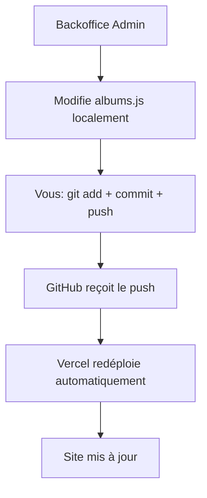

# Workflow Git Simple : Push Manuel → Vercel Auto

## 🎯 Approche simplifiée

### Principe
1. **Backoffice modifie** le fichier [`albums.js`](../client/src/data/albums.js) localement
2. **Vous faites** `git push` manuellement quand vous voulez
3. **Vercel redéploie** automatiquement après le push

## 🔄 Processus complet



## 🛠️ Configuration technique

### 1. Vercel + GitHub
- **Connexion** : Repo GitHub → Vercel
- **Auto-deploy** : Activé sur push vers `main`
- **Pas de tokens Git** nécessaires dans les APIs

### 2. API simplifiée
```javascript
// /api/albums/update-file.js
import fs from 'fs';
import path from 'path';

export default async function handler(req, res) {
  try {
    const { albumsData } = req.body;
    
    // Écrire le fichier albums.js localement
    const filePath = path.join(process.cwd(), 'client/src/data/albums.js');
    const fileContent = `export const albumsData = ${JSON.stringify(albumsData, null, 2)};

// Helper functions...`;

    fs.writeFileSync(filePath, fileContent);
    
    res.status(200).json({ 
      success: true, 
      message: 'Fichier albums.js mis à jour. Faites un git push pour déployer.' 
    });
    
  } catch (error) {
    res.status(500).json({ error: 'Erreur lors de la mise à jour' });
  }
}
```

### 3. Interface backoffice
```javascript
// Message après modification
const handleSave = async () => {
  const response = await fetch('/api/albums/update-file', {
    method: 'POST',
    body: JSON.stringify({ albumsData })
  });
  
  if (response.ok) {
    alert('✅ Fichier mis à jour ! Faites un "git push" pour déployer les changements.');
  }
};
```

## 📋 Workflow utilisateur

### Côté admin (vous)
1. **Utilisez le backoffice** pour modifier les albums
2. **Le fichier [`albums.js`](../client/src/data/albums.js) est modifié** localement
3. **Vous décidez quand déployer** :
   ```bash
   git add client/src/data/albums.js
   git commit -m "Update albums via admin"
   git push origin main
   ```
4. **Vercel redéploie automatiquement**

### Côté technique
- **Pas de commits automatiques**
- **Pas de tokens GitHub** dans les APIs
- **Contrôle total** sur quand déployer
- **Sécurité renforcée** (pas d'accès Git depuis les APIs)

## ✅ Avantages de cette approche

1. **Simplicité** : Pas de gestion Git complexe
2. **Sécurité** : Pas de tokens sensibles
3. **Contrôle** : Vous décidez quand déployer
4. **Fiabilité** : Moins de points de défaillance
5. **Flexibilité** : Possibilité de modifier plusieurs albums avant de déployer

## 🔧 Configuration Vercel

### Variables d'environnement (simplifiées)
```env
# Cloudinary
CLOUDINARY_CLOUD_NAME=your_cloud_name
CLOUDINARY_API_KEY=your_api_key
CLOUDINARY_API_SECRET=your_api_secret

# Authentification
JWT_SECRET=your_jwt_secret
ADMIN_USERNAME=admin
ADMIN_PASSWORD_HASH=hashed_password

# Pas besoin de tokens Git !
```

### vercel.json
```json
{
  "builds": [
    {
      "src": "client/package.json",
      "use": "@vercel/static-build",
      "config": {
        "distDir": "build"
      }
    }
  ],
  "routes": [
    {
      "src": "/api/(.*)",
      "dest": "/api/$1"
    },
    {
      "src": "/(.*)",
      "dest": "/client/build/$1"
    }
  ]
}
```

## 🎯 Résultat final

- **Backoffice fonctionnel** pour gérer les albums
- **Upload Cloudinary** intégré
- **Modification du fichier** [`albums.js`](../client/src/data/albums.js) en local
- **Déploiement manuel** quand vous le souhaitez
- **Coût : 0€/mois**

Cette approche est plus simple, plus sûre et vous donne le contrôle total sur les déploiements !